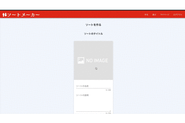
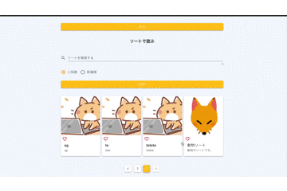

# sort-maker-front

[ソートメーカー](https://sort-maker-front.herokuapp.com)のフロントエンドのリニューアル版<br>

ソートメーカーとはツイッターアカウントでログインするだけでキャラクターや漫画、ゲーム等のソートを作成、公開することができる web アプリ。<br>

公開したソートは他ユーザーに遊んでもらうことができ、自分も他ユーザーのソートで遊ぶことができる<br>

# URL

https://sort-maker-front.herokuapp.com

# デモ

## ソートの作成



## ソートで遊ぶ



# 特徴

- 作成したソートをツイッターでシェアしてフォロワー等に遊んでもらうことができる
- ソート結果をツイッターでシェアすることができるので同じソートで遊んでフォロワー同志で結果を比べあって楽しむことができる
- ツイッター連携ですぐログインできるので面倒な会員登録が不要
- ソートで遊ぶだけならツイッターのアカウント連携さえ不要

# 採用技術の選定理由

- `Vue2`: `Vue3`を採用しようと思ったが、`Vuetify3`が beta 版であり、また、`nuxt3`も RC 版であったため、まだ採用は早いと思ったため、`Vue2`を採用。
- `nuxt2`： ディレクトリ構成がわかりやすく、他開発者が参加した際に `nuxt` の公式サイトを見てもらうだけで構成を把握してもらえるから。ルーティングの手間が減らせるから。バージョンは`nuxt3`が RC 版であったため、`nuxt2`を採用。
- `compositionapi`: `Vue` の公式が`Vue3`をデフォルトバージョンにすると言っているので、現時点で`Vue2`で開発しても、将来的に`Vue3`への移行は必須であり、その移行をできるだけすんなり行うため。
- `typescript`：　現在フロントエンドは`javascript`ではなく`typescript`で開発するのは当たり前となっており、保守・運用の面から見ても`typescript`で開発した方が良いと感じたため。
- `Vuetify`：web アプリの`Vue`の UI フレームワークでは、最も人気があり、情報が豊富なため。公式サイトが日本語で、充実しているため。
- `tailwindcss`:そこまで複雑なデザインをしないのであれば、`tailwindcss`を採用することで`css`を書く必要性がほぼなくなるため。
- `firebase`: 無料でクラウドストレージや外部アプリからの認証などの機能を利用できるため。また、`Vue` + `firebase`という組み合わせで開発している開発者は多く、連携するための情報が豊富だったため。

# 開発環境構築

## 開発環境構築の記載目的

他開発者が開発に参加することを想定し、開発参加時に行う環境構築の方法を記載した。

## vscode 拡張ツールのインストール

以下をインストール

- `ESLint`
- `StyleLint`
- `Prettier`
- `EditorConfig for VS Code`
- `Volar`
- `Tailwind CSS IntelliSense`

## プロジェクトの clone

`git` コマンドが存在しない場合 `git` をインストール<br>

プロジェクトを作成したいディレクトリ配下で下記コマンドを実行

```terminal
$ git clone https://github.com/alichan-69/sort-maker-front.git
```

これ以降作成されたプロジェクト配下でコマンド実行

## 個人用 dev ブランチの作成

下記コマンドを実行

```terminal
$ git branch -b dev-[個人名]
$ git checkout dev-[個人名]
```

以下作業は個人ブランチで続行

## node、yarn のインストール

`nvm` コマンドが存在しない場合 `nvm` をインストール<br>

`sort-maker-front` で使用されている `node` のバージョンをインストールし、アクティブな `node` のバージョンとして切り替える<br>

また、`node` のバージョンに依存する `yarn` をインストールしたいため、`node` バージョン切り替え後、`yarn` もインストールする<br>

下記コマンドを実行

```terminal
$ nvm install
$ nvm use
$ npm install yarn
```

## プロジェクトで使用するライブラリのインストール

下記コマンドを実行

```terminal
$ yarn install
```

## ローカルサーバーの立ち上げ

下記コマンドを実行

```terminal
$ yarn dev
```

## リポジトリへの push

リモートリポジトリを追加し、`commit`、`push` までを行う<br>

`commit` 前には**ファイルにエラーを示す赤線はでてないか**を必ず確認すること<br>

ファイルを適当に変更して、下記コマンドを実行

```terminal
$ git remote add origin https://github.com/alichan-69/sort-maker-front.git
$ git commit -a -m "first commit"
$ git push --set-upstream origin dev-[個人名]
```

# 設計方針

## 設計方針の記載目的

他開発者が開発に参加することを想定し、開発参加時に理解しておいてほしい設計方針を記載した。<br>

より詳細な設計は実際に開発者が参加してから作成する。

## typescript 設計方針

### 型チェックのルールの設定

`@tsconfig/strictest`の型チェックのルールを採用。<br>

当初、`@tsconfig/strictest`をインストールして、下の様に型チェックルールを`tsconfig.json`に設定しようとしていた。

```json:tsconfig.json
{
    "extends": "@tsconfig/strictest/tsconfig.json"
}
```

が、設定が反映されなかったため、下記の様に`@tsconfig/strictest/tsconfig.json`をコピペし、`tsconfig.json`に直接記載。

```json:tsconfig.json
{
  "allowUnusedLabels": false,
  "allowUnreachableCode": false,
  "noFallthroughCasesInSwitch": true,
  "noImplicitReturns": true,
  "noUncheckedIndexedAccess": true,
  "noUnusedLocals": true,
  "noUnusedParameters": true,
  "importsNotUsedAsValues": "error",
  "checkJs": true,
  "esModuleInterop": true,
  "skipLibCheck": true,
  "forceConsistentCasingInFileNames": true
}
```

### 型チェックの設定

型チェックは `commit` 前に`husky`で行うようにしている。<br>

その際、`js`、`ts`ファイルは `tsc` コマンドでのチェック、`vue`ファイルは`templates`内も型チェックしたかったため、`vue-tsc`コマンドでのチェックを行なっている。<br>

### 型付の方針

- `any` 型は基本使用しないようにする
- `@ts-ignore`は使用しない様にする、やむを得ない場合無視したルール名をコメント内に記載。
- コンポーネントの `props` では、基本`type`を記載。`type`が`Object`、`Array`、`Function`だった場合は下記の様に`PropType`を用いてより詳しい型を記載。

```vue:ExampleComponent.vue
<script lang="ts">
import { defineComponent, PropType } from '@nuxtjs/composition-api'
import type { Click } from '@/types/event'

type ClickExample = (example: number) => void | Click
type ExampleObject = {
  example1: number
  example2: number
}

export default defineComponent({
  props: {
    exampleArray: {
      type: Array as PropType<number[]>,
      default: () => [],
      require: false,
    },
    exampleObject: {
      type: Object as PropType<ExampleObject>,
      default: () => ({}),
      require: false,
    },
    clickExample: {
      type: Function as PropType<ClickExample>,
      default: () => {},
      require: false,
    },
  }
})
</script>

```

## コンポーネント設計方針

### コンポーネント化するかの判断基準

- `template` で二つ以上のタグを使用し、コンポーネントを二回以上使用
- `template` で一つのタグのみ使用するが統一したい `CSS` や統一して設定したい `props` がある
- コンポーネントは一度しか使用されないが、紐づくロジックや `templates` が膨大で見通しが悪い

### コンポーネント作成した際の格納先のディレクトリ

コンポーネントを作成した際は`components`ディレクトリにコンポーネントを格納。<br>

更に`components`ディレクトリの中で下の様にコンポーネントを分類して格納。<br>

```text
├── components/
  ├── Parts/ templates内で一つのタグのみ使用するコンポーネントを格納
    ├── Link/ 同一系統のコンポーネントはディレクトリでまとめる
    ├── DefaultButton.vue コンポーネント。同一系統のコンポーネントが複数作成されることが想定され、デフォルトになるコンポーネントを作成する際、またはコンポーネント名が英単語一文字のみで構成される際コンポーネント名の頭にDefaultを付与する
    ├── index.ts エントリーポイント
  ├── Templates/ templates内で二つ以上のタグを使用するコンポーネントを格納
  ├── Views/ ロジックでapi通信を行うコンポーネントを格納
```

コンポーネントの分類方法の参考は[ここ](https://zenn.dev/offers/articles/20220523-component-design-best-practice#%E3%80%90%E8%B5%A4%E3%80%91parts)

## 状態管理設計方針

- 親コンポーネントから子コンポーネントの状態を利用する際は次の優先順位で実装
  - 親コンポーネントで利用する状態と状態を変化させるメソッドを子コンポーネントで props として実装。親コンポーネントで状態とメソッドを実際に実装。
  - 子コンポーネントに `refs` を実装。親コンポーネントから `refs` で子コンポーネントの状態にアクセス。
- 子コンポーネントから親コンポーネントの状態を利用する際は `props` を使用
- 複数の関連性の薄いコンポーネントを跨ぐ状態は `vuex` で管理(例：別ページ間での状態の共有等)

## firebase 設計方針

### FirebaseCloudStorage のディレクトリ構成

以下の様に登録された画像を格納していく<br>

```text
├── images/ 画像を格納する
  ├── sort_titles/ ソートタイトルの画像を格納する
    ├── {sort_id}/ ソートタイトルの画像の名前
  ├── sort_items/ ソートアイテムの画像を格納する
    ├── {sort_id}_{sort_item_id}/ ソートアイテムの画像の名前
```

# 開発時に知っておいて欲しい情報

## 開発時に知っておいて欲しい情報の記載目的

他開発者が開発に参加することを想定し、開発時に知っておいてほしい情報をまとめた<br>

## ライブラリの追加方法

ライブラリを`dependencies`に追加するか`devDependencies`に追加するかを決定

- `devDependencies`：開発時に利用するライブラリを追加。主に lint 等、コード成形ツールや `type` が他ファイルからインポートされてない `type` ファイル等。
- `dependencies`：上以外を追加。

`dependencies`に追加する場合、下記コマンドを実行

```terminal
$ yarn add [ライブラリ名]
```

`devDependencies`に追加する場合、下記コマンドを実行

```terminal
$ yarn add -D [ライブラリ名]
```

ライブラリの`@types`が存在する場合は、それもインストール

```terminal
$ yarn add -D "@types/hoge"
```

その後、`tsconfig.json`の types に`@types`を設定

```json:tsconfig.json
{
  "types": [
    "@types/hoge"
  ]
}
```

## tailwindcss の plugin の追加方法

`terminal` から `plugin` をインストール

```terminal
$ yarn add "hoge"
```

`tailwind.config.js`の`plugins`に `plugin` を追加

```javascript:tailwind.config.js
{
  plugins: [
    require('hoge')
  ]
}
```

## 環境変数の追加方法

追加したい環境変数を開発環境用、本番環境用それぞれ`.env`に下記の様に追加<br>

ブランチの環境に応じて使用しない環境変数をコメントアウトすることで使い分ける

```.env
# 開発環境用
APP_URL = MAIN_APP_URL

# 本番環境用
# APP_URL = PRODUCTION_APP_URL
```

`nuxt.config.js`で`publicRuntimeConfig`に環境変数を設定して、`src`ディレクトリ内で使用できる様にする

```javascript:nuxt.config.js
export default {
  publicRuntimeConfig: {
    APP_URL: process.env.APP_URL,
  },
}
```

`src`ディレクトリ内で以下の様に利用

```vue:Example.vue
<script lang="ts">
import { useConfig } from '@/composables'

const { config } = useConfig()

console.log(config.APP_URL)
</script>

```

## ESLint のルール無視する方法

`eslint-disable`は使用しない様にする、やむを得ない場合無視したルール名をコメント内に記載。
